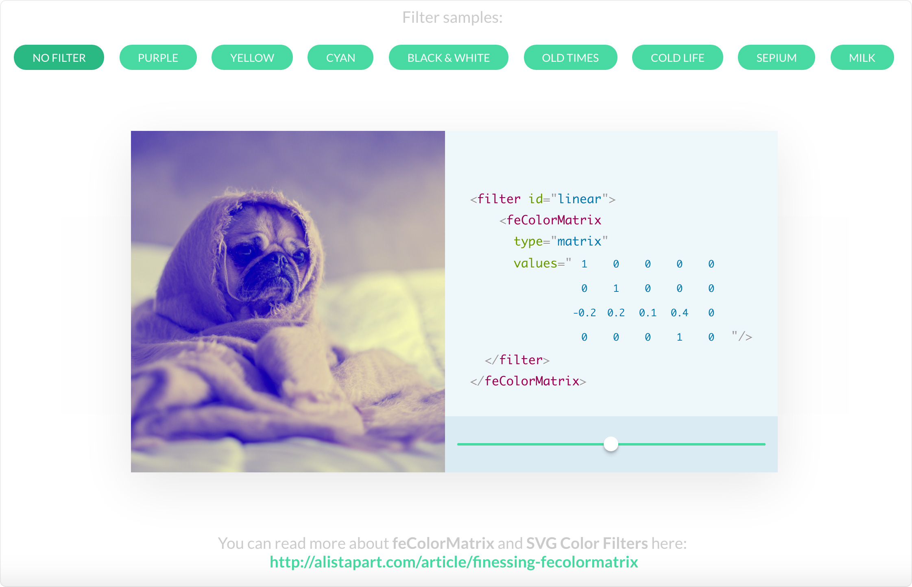

# svg-color-filter
A simple project to help understand SVG's powerful feColorMatrix filter.

SVG Color Filter is a playground to help understand **feColorMatrix** in practice. Select between pre-baked sample filters, or change the values yourself and see the filter applied to the image in realtime.

If you never heard of **feColorMatrix** before, you should start with **[this awesome article](http://alistapart.com/article/finessing-fecolormatrix)** (which in fact is what inspired me to make this project).

This project is aimed to be a playground only. If you need production-ready libraries to give your image filters, you should try [CSSgram](https://github.com/una/CSSgram), [glfx.js](https://github.com/evanw/glfx.js), [canvasfilters](https://github.com/kig/canvasfilters) or any other lib for that matter.

**Compatibility issues:**
SVG filters are a relatively "new" feature, thus older browsers (IE < 10) will ~~not~~ probably have trouble loading the effects.
